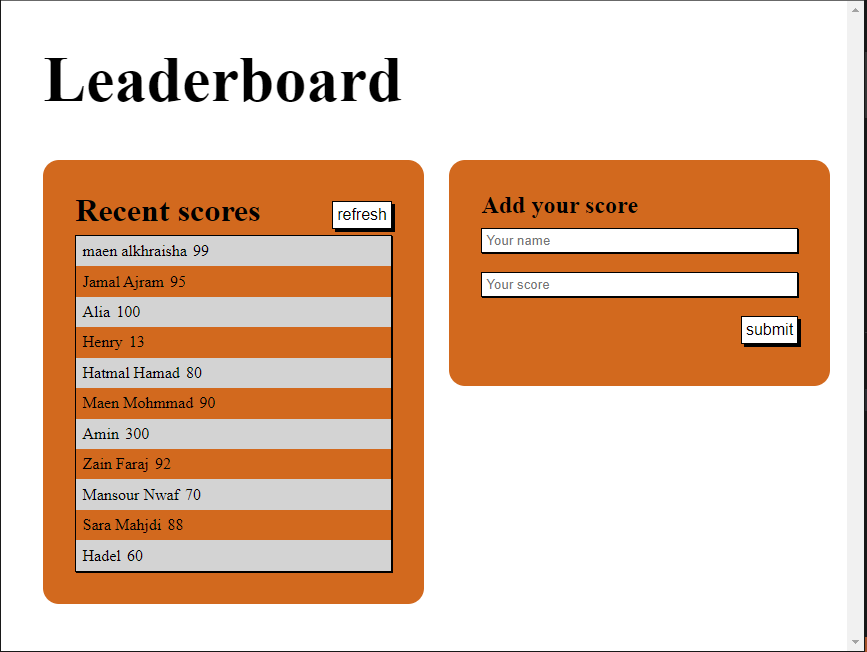

# Leaderboard

> Leaderboard Application.
 JavaScript project for the Leaderboard list app, using webpack and ES6 features, notably modules. The Leaderboard consuming API using JavaScript async and await. This project uses minimum styling and focuses on functionality.

## Built With

- HTML&CSS
- VScode 
- JS
## Technologies
- webpack
- JS6 module

## out resource
    use external API :
    https://us-central1-js-capstone-backend.cloudfunctions.net/api/games/VYz14K82vE17A0uJo9Rl/scores/
## Live Demo 

Go to live demo : 
https://maenkhraisha.github.io/Leaderboard/



## Getting Started

**First open VS code**<br/>
**From the VS code terminal navigate to the folder where you want to download the project**<br/>
```
$ git clone git@github.com:maenkhraisha/Leaderboard.git
```

use
``` 
npm install 
```

use 
```
npm start
```


### Prerequisites
VScode


## Authors

👤 **Maen Al-khraisha**

- GitHub: [@githubhandle](https://github.com/maen1980)
- Twitter: [@twitterhandle](https://twitter.com/AlkhryshaM)
- LinkedIn: [LinkedIn](https://www.linkedin.com/in/ma-en-mohammad-303930100/)


## 🤝 Contributing

Contributions, issues, and feature requests are welcome!

Feel free to check the [issues page](../../issues/).

## Show your support

Give a ⭐️ if you like this project!

## Acknowledgments


## 📝 License

This project is [MIT](./MIT.md) licensed.
